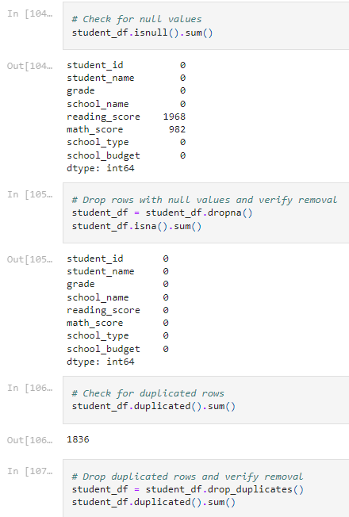
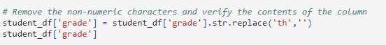
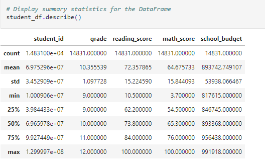
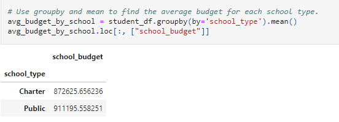

# School_District_Analysis

In the first deliverable, I pulled our data from the CSV. The data included the ‘student id’, ‘student name’, ‘grade, ‘school name’, ‘reading score’, ‘math score’, ‘school type’, and the ‘school budget’. In the second deliverable, I prepared the data. First objective was to check for null values by using isnull( ) and then to see how many null values we had, we used our sum( ) function!
### Checking for Null values

I dropped the null values using the dropna( ) and once again used sum( ) to verify that I have removed the null values. To even further clean our data, I had to check for duplicates and drop them with the drop_duplicates ( ) function.

I examined the grade column a little closer and discovered that the column type came out to an object so I took the str.replace( ) function and removed the ‘th’ and turned it into an integer with the astype( ) function with ‘int’ (integer) placed inside the parenthesis.
### Replacing the string

In deliverable three, we summarized the data. For the whole data frame I used the describe( ) function, with this function we see the number of elements in the columns, the average value of a column, how spread out the values are distribution wise, the minimum value in the column, the value that occupies 25%, 50%, and 75% of the dataframe (which also shows distribution) and the maximum value in the column. I also took this course of action with the rows for grade 9.
### Describe function

I discovered the reading scores for ONLY the tenth graders in Dixon High by using loc with conditionals and afterwards found the mean for all students in grade eleven and twelve by using the ‘pipe’ key instead of an ‘ampersand’. We use the pipe because a student cannot be in both eleventh and twelfth grade at the same time. With this, the mean reading score ended up to be 74.900381%

Deliverable five was the start of my summary. We had to use the groupby ( ) function to pull out separate columns and define them. I pulled out the two different school types and the average budget. For a Charter School, the data shows 911195.

### Groupby ( ) Function

With this data pulled we can find find the differences between schools and see if their budget or the amount of students had anything to impact it!
